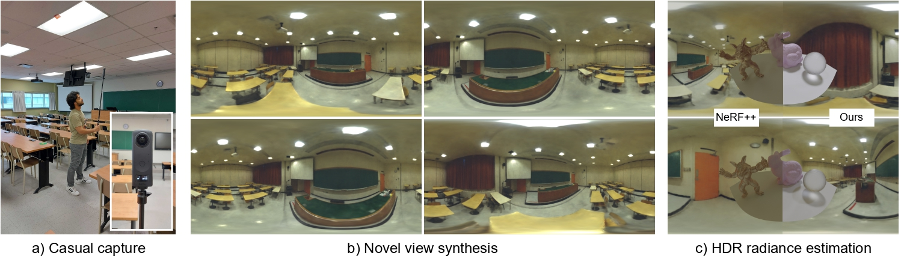

<h1 align="center">Casual Indoor HDR Radiance Capture from Omnidirectional Images</h1>

<b>British Machine Vision Conference 2022</b>

  
    <a href="https://darthgera123.github.io/">Pulkit Gera1</a>,
    <a href="https://scholar.google.com/citations?user=lJmcRbUAAAAJ&hl=en">Mohammad Reza Karimi Dastjerdi2</a>,
    <a href="https://www.linkedin.com/in/charles-renaud-6b6b6622a/?locale=en_US">Charles Renaud2</a>,
    <a href="https://faculty.iiit.ac.in/~pjn/">P J Narayanan1</a>
    <a href="http://www.jflalonde.ca/">Jean-François Lalonde2</a>
  

1CVIT, IIIT Hyderabad

2Université Laval

  
    <a href="https://lvsn.github.io/PanoHDR-NeRF/">[Project page]</a>
    <a href="https://arxiv.org/abs/2208.07903">[Paper]</a>
    <a href="https://www.youtube.com/watch?v=_mUeHePYQF8">[Video]</a>
    <a href="">[Data]</a>
    <a href="./bibtex.txt">[bibtex]</a>
  

<b>Abstract</b> 
  We present PanoHDR-NeRF, a novel pipeline to casually capture a plausible full HDR radiance field of a large indoor scene without elaborate setups or complex capture protocols. First, a user captures a low dynamic range (LDR) omnidirectional video of the scene by freely waving an off-the-shelf camera around the scene. Then, an LDR2HDR network uplifts the captured LDR frames to HDR, subsequently used to train a tailored NeRF++ model. The resulting PanoHDR-NeRF pipeline can estimate full HDR panoramas from any location of the scene. Through experiments on a novel test dataset of a variety of real scenes with the ground truth HDR radiance captured at locations not seen during training, we show that PanoHDR-NeRF predicts plausible radiance from any scene point. We also show that the HDR images produced by PanoHDR-NeRF can synthesize correct lighting effects, enabling the augmentation of indoor scenes with synthetic objects that are lit correctly.

# LDR2HDR
Instructions for running LDR2HDR module are present in `LANet` directory. 

# PanoHDR-NeRF
Instructions for running and installing NeRF module is present in `PanoHDR_NeRF` directory.